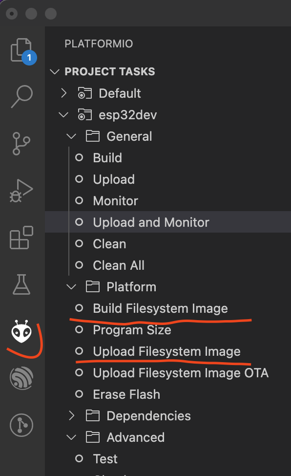

# The simple and up to date example of using FAT FS on ESP32 and platfromio

## How I tested

My hardware is [LilyGO TTGO T-Display](https://www.lilygo.cc/products/lilygo®-ttgo-t-display-1-14-inch-lcd-esp32-control-board) esp32 board.
It's an ESP32-based board with 4MB of flash memory.

# How to use FFAT?

1. Add to platfromio.ini `board_build.filesystem = fatfs`
2. Select the right partition layout option `board_build.partitions = noota_3gffat.csv` with some partition layout .csv. You may chose some predefined partition layout from ESP-IDF example. I used `noota_3gffat.csv`.
3. Create a data folder and put in the files that you want to upload to the board flash memory.
4. PlatformIO -> Board Configuration -> Build Filesystem Image (see image below)
5. PlatformIO -> Board Configuration -> Upload filesystem Image (see image below)


6. Add the includes:

```c
#include "FS.h"
#include "FFat.h"
```

7. In setup method before using any FFat methods initialise and mount the FFat partition:

```c
if(!FFat.begin(false)){ // Change to true if you want to format the partition on mount error
    Serial.println("An Error has occurred while mounting FFat");
    return;
  }
```

8. Read/Write/Append files. Open a file using the appropriate mode or combination:

```c
// open file
  File file = FFat.open("/test.json", "r");
  if(!file){ // Don't forget to check if the file was opened successfully
    Serial.println("Failed to open test.json file for reading");
    return;
  }
```
9. File operation:

```c
while(file.available()){
    Serial.write(file.read());
  }
```

10. Don't forget to close the file:

```c
fileTmp.close();
```

## Useful links and utilities

[How to use custom partition tables on ESP32](https://blog.espressif.com/how-to-use-custom-partition-tables-on-esp32-69c0f3fa89c8)

[FATFS on ESP32 ](https://github.com/marcmerlin/esp32_fatfsimage) - partly out of date, but the Arduino sketch will work if you need it.


### Parttool

Parttool allows you to read and write partitions.

With installed to the default location Espressif ESP-IDF you will find partttol at(macos):
`$HOME/esp/esp-idf/components/partition_table`

I set up IDF_PATH environment variable first:
`export $IDF_PATH=$HOME/esp/esp-idf`

then I run parttool to read the FAT partitions into the ffat.bin file:
`./parttool.py --port "/dev/tty.SLAB_USBtoUART" read_partition --partition-type=data --partition-subtype=fat --output "ffat.bin"`
, where `/dev/tty.SLAB_USBtoUART` is the USB serial port of the board.